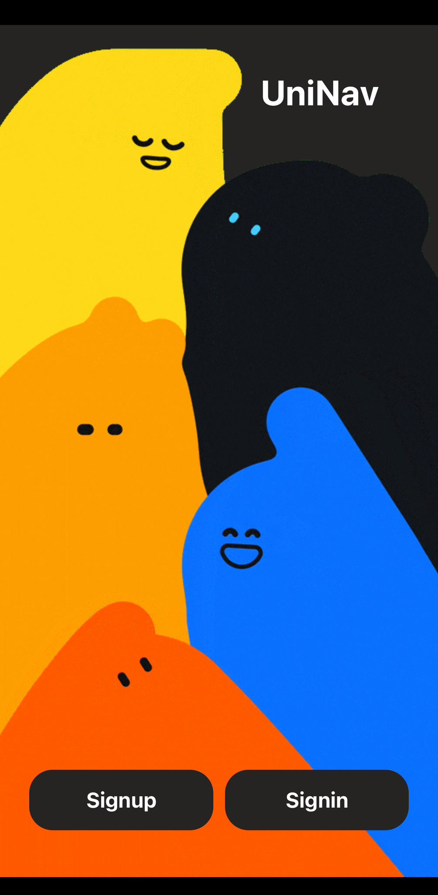
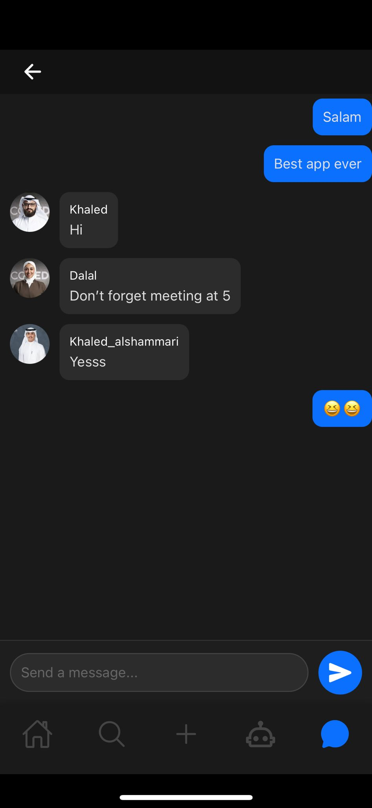
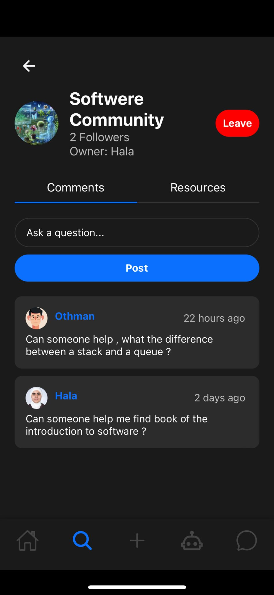
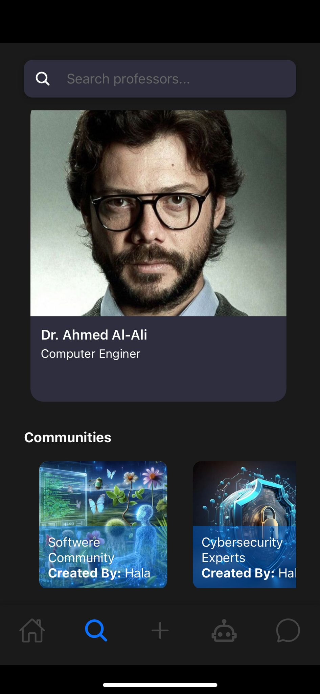
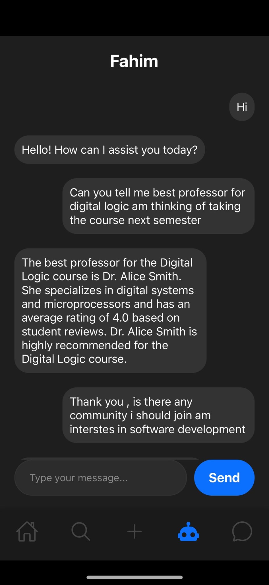

# UniNav: Student Resource Hub

## Description
**UniNav** is a comprehensive student resource platform designed to help students discover, share, and collaborate on study materials, as well as connect with peers.

## Features
- **User Registration:** Easy sign-up and login process.
- **Resource Management:** Browse, upload, and share study resources like notes, past exams, and homework.
- **Peer Feedback:** Share notes, receive feedback, and ask questions for peer assistance.
- **Community Interaction:** Invite friends, create/join study groups and communities, and chat with other students.
- **Notifications:** Receive notifications for new study materials or reviews.
- **Bookmarking:** Bookmark courses and resources for easy access.
- **Profile Management:** Create and manage a profile to track courses and interactions.
- **Course Ratings and Reviews:** Rate course difficulty, see average ratings, and read professor reviews.
- **AI Assistants:** Utilize AI voice and text assistants to help with studies.

## Technologies Used
- Expo
- React Native
- CSS
- Node.js
- Express
- MongoDB

## Backend GitHub
- [Backend Repository](https://github.com/your-repo-link)

## Showcase Images
Here are some images showcasing our platform:

## Contributors
- Hala Almutairi
- Dalal Alhoshan
- Khaled Al-Swayed
- Khaled Alshammari
